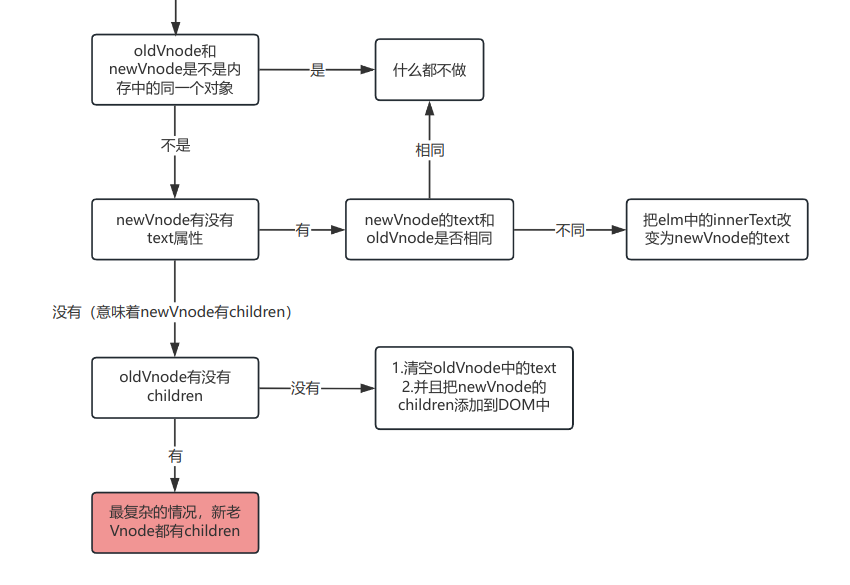
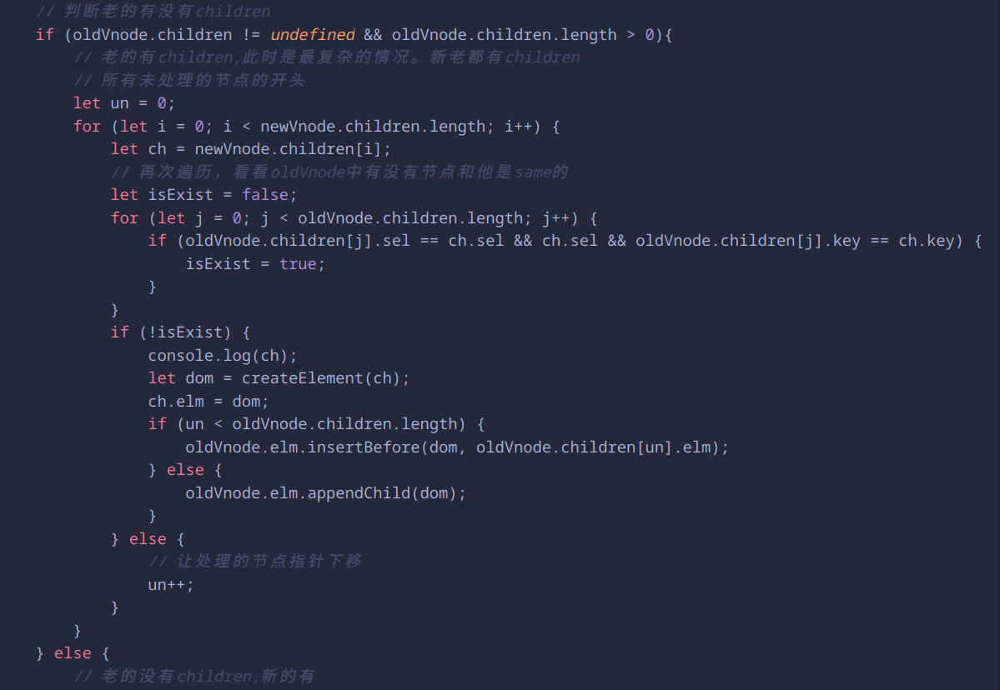

# 手写虚拟DOM
算法思想：
1. 如果新老节点不是同一个节点名称，那么就暴力删除旧的节点，创建插入新的节点。
2. 只能同级比较，不能跨层比较。如果跨层那么就暴力删除旧的节点，创建插入新的节点。
3. 如果是相同节点，又分为很多情况 
   1. 新节点有没有children  
        如果新的节点没有children，那就证明新节点是文本，那直接把旧的替换成新的文本
   2. 新节点有children  
         新的有children，旧的也有children：就是diff算法的核心了  
         新的有children，旧的没有：创建元素添加（把旧的内容删除清空掉，增加新的）
   3. diff算法的核心（最复杂的情况）
      1. 旧前 和 新前    
            匹配：旧前的指针++ 、 新前的指针++
      2. 旧后 和 新后    
            匹配：旧后的指针-- 、 新后的指针--
      3. 旧前 和 新后    
            匹配：旧前的指针++ 、 新后的指针--
      4. 旧后 和 新前    
            匹配：旧后的指针-- 、 新前的指针++
      5. 以上都不满足条件：查找      
            新的指针++，新的添加到页面上并且新在旧的种有，要给旧的复制成undefined
      6. 创建或者删除    
注意：如果要提升性能，一定要加入key，key是唯一标示，在更改前后，确认是不是同一个节点。

## diff处理新旧节点

## 手写第一次上树时：只有文本的情况

## 手写递归创建子节点

这里删除老节点有错误，删除的应该是oldVnode.elm，后面已改正

## diff处理新旧节点是同一节点时

## 手写新旧节点text的不同情况

## 尝试书写diff更新子节点

这个算法有点杂糅，可以看后面的

## diff算法的子节点更新策略
四种命中查找：  
<b>① 新前与旧前</b>  
<b>② 新后与旧后</b>  
<b>③ 新后与旧前</b>  
<b>④ 新前与旧后</b>  
命中一种就不再进行命中判断了  
如果都没有命中，就需要用循环来寻找了  
如果是新节点先循环完毕，如果老节点中还有剩余节点(旧前和新后指针中间的节点)，说明他们是被删除的节点  
当③命中的时候，此时要移动节点，移动新前指向的这个节点到老节点的<b>旧后的后面</b>  
当④命中的时候，此时要移动节点，移动新前指向的这个节点到老节点的<b>旧前的前面</b>

